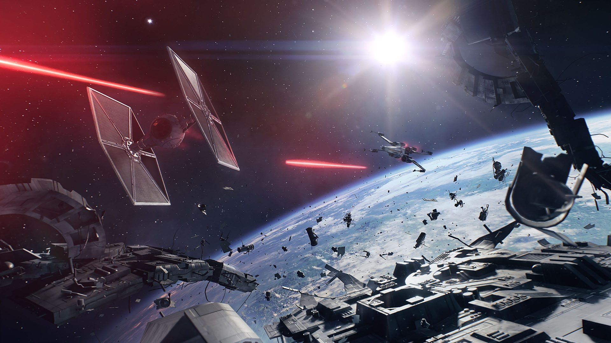
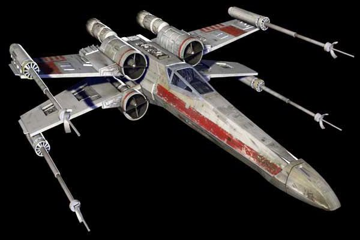
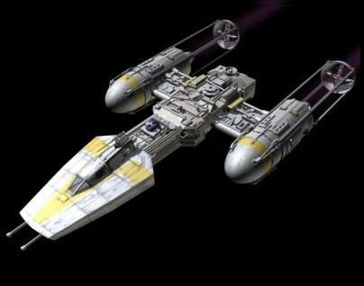
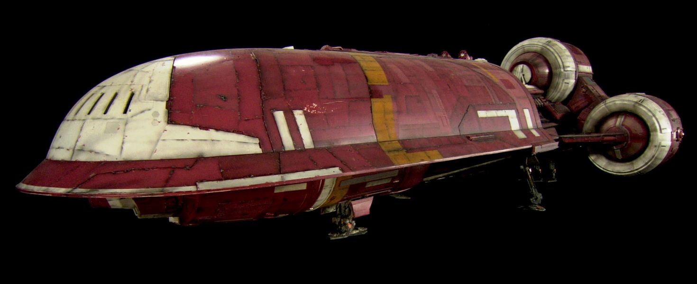
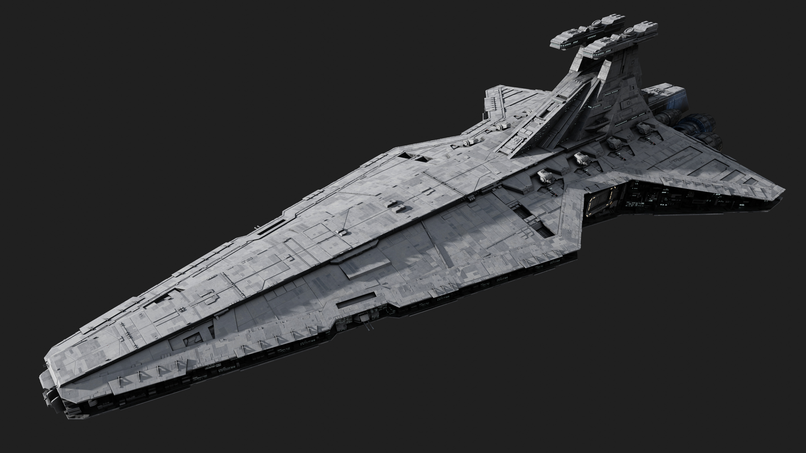

<body style="background-color:#090316;">
</body>

---
---
# **HUNDIR LA FLOTA ESTELAR**

## **Proyecto realizado como práctica para TheBridge**
---

- [**Índice del Proyecto**](#indice-del-proyecto)
  1. [**Descripción**](#descripción)
  2. [**Funcionamiento**](#funcionamiento)
  3. [**Programas Necesarios**](#programasnecesarios)
  4. [**Miembros del Equipo de Desarrollo**](#miembros-del-equipo-de-desarrollo)
  
<!-- TOC -->

### **Descripción**
--- 
Este proyecto tiene como objetivo simular el clásico juego "Hundir la flota", al cual todos hemos jugado siendo niños. En nuestro caso, hemos querido darle un toque más espacial. Para ello hemos utilizado el lenguaje de programación Python.  

### **Funcionamiento**
---
El programa funciona de la siguiente manera una vez ejecutado: 
- Da la bienvenida al jugador, el cual da su nombre y escoge si quiere colocar las naves de manera manual o aleatoriamente sobre el tablero, que simula el espacio. 
- Dependiendo de la respuesta, el tablero se genera mediante una serie de funciones. 
    1. Caso 1. El jugador escoge las posiciones en las que quiere colocar las naves y una vez escogidas dichas posiciones se genera el tablero con las naves ya colocadas. 
    2. Caso 2. Simplemente el tablero se genera con las naves colocadas de manera aleatoria. 
- Posteriormente, se generará otro tablero con naves tambíen colocadas de manera aleatoria que controlará la computadora. 
- A su vez, se generarán otros dos tableros vacíos que servirán al jugador y a la computadora para saber donde han disparado ya y así no repetir disparos. Todos los tableros generados tedrán un tamaño de 10x10 espacios. 
- Las naves con las que se llevará a cabo la batalla estelar serán las siguientes:

|   Diseño                   |               |                   |                          |                       |
|:-------------------------:|:------------------:|:-----------------:|:------------------------:|:---------------------:|
|       **Nombre**       | **Caza Estelar** | **Bombardero** | **Lanzadera Espacial** | **Crucero Estelar** |
|  **Número de unidades** |  **4 Unidades**  |  **3 Unidades** |     **2 Unidades**     |     **1 Unidad**    |
| **Tamaño de las Naves** |  **1 de Eslora** | **2 de Eslora** |     **3 de Eslora**    |   **4 de Eslora**  |
---
- Una vez terminados los preparativos comienza la batalla y el turno del jugador. 
- Mediante funciones el jugador escoge una posición a la que disparar y se pueden dar varios casos:
    
    1.  El tiro no da en el blanco, por lo tanto pasa al turno de la computadora. 
    2. El tiro da en el blanco, por lo tanto el jugador vuelve a tener otro disparo.
    3. El tiro se sale de las coordenadas del tablero, por lo tanto al jugador tiene que volver a marcar unas coordenadas donde disparar.
- Una vez terminado el turno del jugador, da comienzo el turno de la computadora. Este turno sigue el mismo patrón que el del jugador. 
- Si es el jugador el primero en perder todas sus naves, gana la computadora.
- Si es la computadora la primera en perder todas sus naves, gana el jugador. 

### **Programas Necesarios**
---
Hemos realizado este proyecto utilizando el lenguaje de programación python. Hemos creado también diferentes funciones cuyos scripts están disponibles para ser consultados siempre que sea necesario. También hemos utilizado Visual Studio Code para la elaboración en Markdown del Archivo Readme de este proyecto. 

### **Miembros del Equipo de Desarrollo**
---
|              Nombre             |       Correo Electrónico      | LinkedIn | 
|:-------------------------------:|:-----------------------------:|:--------:|
|   Francisco Javier Ruiz Guerra  |     franx.guerra@gmail.com    |    [LinkedIn](https://www.linkedin.com/in/fran-ruiz-guerra)      | 
| Daniel Alejandro Soria Martínez |     danielsoriam@gmail.com    |  [LinkedIn](https://www.linkedin.com/in/danielsoriamartinez/)        |
|        Mario Chacón Ruiz        | mario.chaconruiz93@gmail.com  |     [LinkedIn](https://www.linkedin.com/in/mario-chac%C3%B3n-ruiz-1618841ab)    |
|   Jose Enrique Vera Rodríguez   |     kikewnguitar@gmail.com    |   [LinkedIn](https://www.linkedin.com/in/jose-enrique-vera-rodriguez-7a04bb222)       |