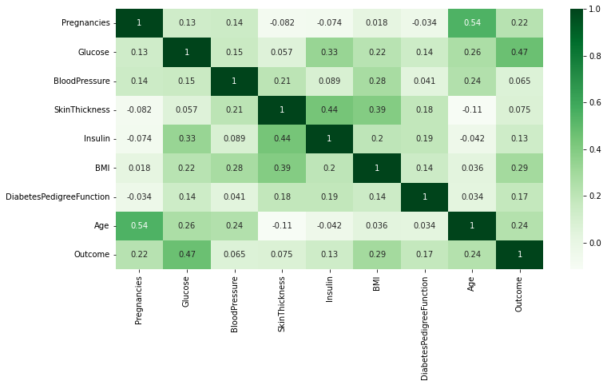
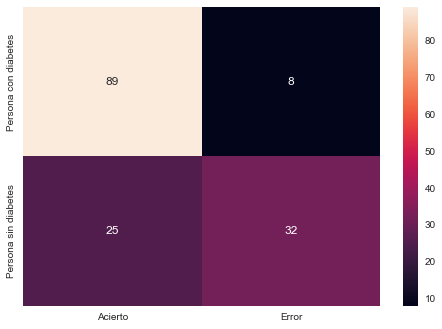

  <body style="background-color:#808000;">
</body>

---
---
# **EDA Y PROYECTO DE MACHINE LEARNING: PREDICCIÓN DE DIABETES**

## **Proyecto realizado por Jose Enrique Vera Rodríguez como práctica para TheBridge**
---
- [**Índice del Proyecto**](#indice-del-proyecto)
  1. [**Descripción**](#descripción)
  2. [**Análisis Exploratorio de Datos**](#AnálisisExploratoriodeDatos)
  3. [**Modelo: Logisctic Regression**](#Modelo:LogisticRegression)
  4. [**Validación del modelo y Conclusiones Finales**](#ValidacióndelmodeloyConclusionesFinales)
  5. [**Datos de contacto**](#Datosdecontacto)

<!-- TOC -->
---
### **Descripción** 
---

Este proyecto consiste en la predicción de la diabetes, tomando en cuenta distintos factores como la edad, la presión sanguinea o los niveles de glucosa en la sangre. 

Estos distintos factores son los que conformaran nuestras variables, y tenemos 9: Age(Edad), Pregnancies(la diabetes en mujeres embarazadas), Glucose(Glucosa en Sangre), SkinThickness(Problemas en la piel), Insulin(Niveles de Insulina), BMI(Índice de masa corporal), Outcome(Dato real de si el usuario es diabético). 

Esta última variable la eliminaremos durante la puesta en marcha de nuestro modelo predicctivo para que los datos reales no influyan en los resultados. 

--- 
### **Análisis Exploratorio de Datos** 
---
Durante el EDA cargaremos nuestro fichero csv y posteriormente procederemos a analizar y representar gráficamente los datos. 

##### Ejemplo de Gráfica de calor que se encuentra en el archivo completo.
---
### **Modelo: Logistic Regression**
---
Como mencionamos al principio, lo primero que hacemos es eliminar la variable "Outcome" de nuestro csv para así evitar que el tarjet final influya en nuestro modelo. 

Posteriormente ponemos en práctica nuestro modelo entrenándolo con las diferentes variables que tenemos, obteniendo resultados iniciales de accuracy de entre un 0.878 y un 0.59. 

Tras ajustar el modelo, obtenemos un accuracy final de un 0.79. 

---
### **Validación del modelo y Conclusiones Finales** 
---
Hemos validado nuestro modelo mediante validación cruzada, partiendo los datos en 10 partes y entrenándolos por separado. Estos han sido los resultados: [0.74193548 0.80645161 0.75806452 0.85483871 0.78688525 0.63934426, 0.83606557 0.85245902 0.7704918  0.73770492]. Como podemos observar, los resultados cuadran con el resultado final. 

Vamos a observar la Matriz de confusión: 

- A raíz de la matriz de confusión podemos sacar las siguientes conclusiones:
1. Nuestro modelo es eficaz a la hora de detectar la mayoría de casos positivos de diabetes. 
2. Nuestro modelo también detecta casos de personas que no poseen la enfermedad, aunque en menor medida. 
3. Nuestro modelo debe mejorar al detectar las personas que no padecen la enfermedad, ya que detecta muchas más personas de las que debería como “No diabéticos”, cuando sí lo son.

---
### **Datos de Contacto** 
---
| Nombre                      | Email                  | LinkedIn | GitHub |
|-----------------------------|------------------------|----------|--------|
| José Enrique Vera Rodriguez | kikewnguitar@gmail.com |     [Lindekdin](https://www.linkedin.com/in/jose-enrique-vera/) | [GitHub](https://github.com/kike272) |

